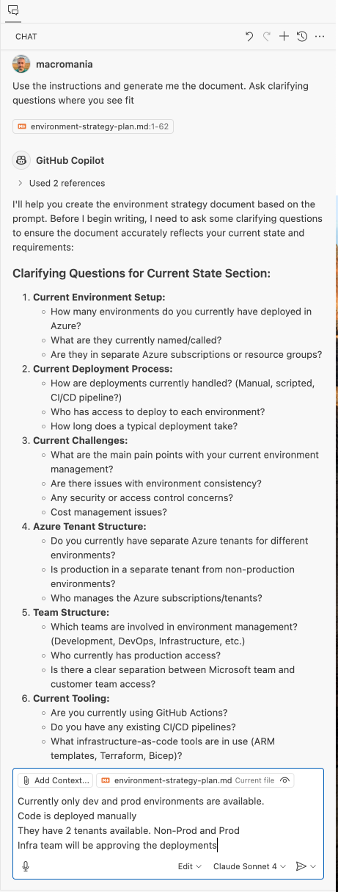
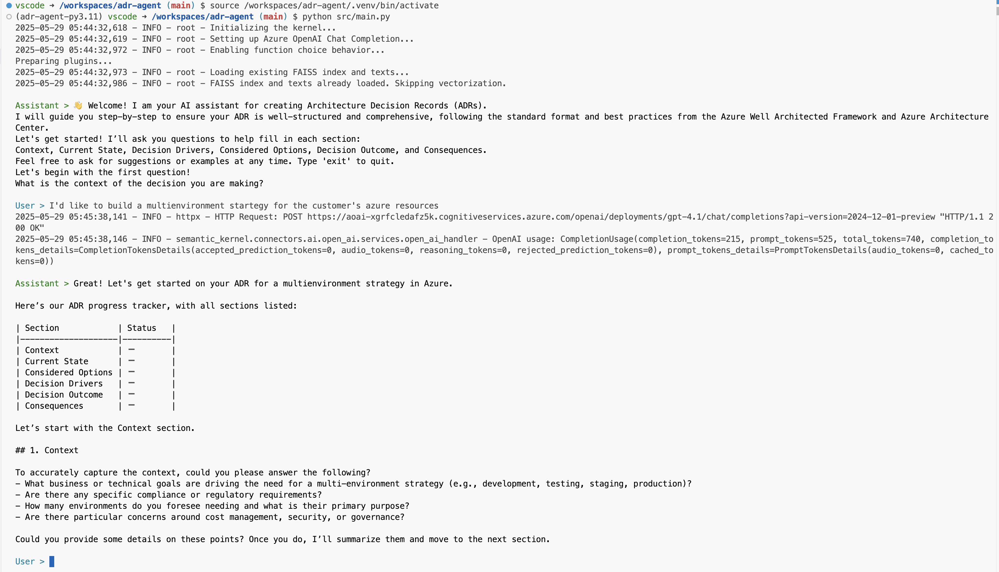

# ADR Agent & Prompts

Architecture Decision Records (ADR) are a way to capture architectural decisions made while developing a software project. This repository contains sample prompts for a chat experience and a single agent with tool use to assist in the creation of an ADR.

ADRs created with this repo, either prompt-based or agent-based, should be seen as a starting point and drafts. They should be reviewed and refined by the team to ensure they meet the project's needs and customer requirements. You need to socilize the ADRs with your team and stakeholders and the tools provided here are to reduce cold start time for writing an ADR.

## Prompts

Couple of prompts are provided under `/prompts` directory. These prompts are designed to be used in a chat experience usually within VSCode Copilot. You can use these prompts as `copilot-instructions.md` in your project while chatting with GitHub Copilot. Context set by these prompts will be guiding the LLM to generate ADRs with consistent structure and content. The prompts are also encouraging LLM to ask questions and clarify the context before generating the ADR. If you use `Edit` mode with Github Copilot, the prompts will also help LLM to write the ADR and update as you go along.

### Prompts Usage

1. In VSCode Edit Mode, attach the prompt you would like to use as `copilot-instructions.md` in your project or in your chat context.
2. Choose a model that has reasoning and planning capabilities, such as `gpt-4o` or `Cloude Sonnet 4`.
3. When the prompt is in the context, start the chat with `Edit` mode with a simple command like `Use the instructions and generate me the document. Ask clarifying questions where you see fit`.

## Agent

When chatting with GitHub Copilot, you may need extra help for grounding the draft with Azure Well-Architected Framework and other Azure best practices. The agent provided in this repo is designed to assist you in this process. The agent indexes latest Azure Well-Architected Framework PDF downloaded in the source code as FAISS vector store for simplicity. If needed, there is a PII Detection and Redaction tool to help you redact sensitive information from the ADR before sharing it with others. Output plugins is also used to save your progress in `/outputs` directory as a markdown file for each section. This can be useful if you'd like to reuse or socilaize certain sections of the ADR with your team or stakeholders.

Agent is instructed to track the progress of each ADR section and visualises the progress with a simple table in the output. When all sections are completed, the agent will generate a final ADR markdown file with all sections combined. 

### Agent Usage

1. Create a new `.env` file in the root directory and copy the contents of `.env.example` into it. You can use `/scripts/create-env.sh` to create a new Azure Open AI deployment and set the `.env` file.
2. Run `python src/main.py` to start the agent.
3. Until you interrupt the process with Ctrl+C or type `exit`, the agent will be running and ready to assist you with ADR creation.